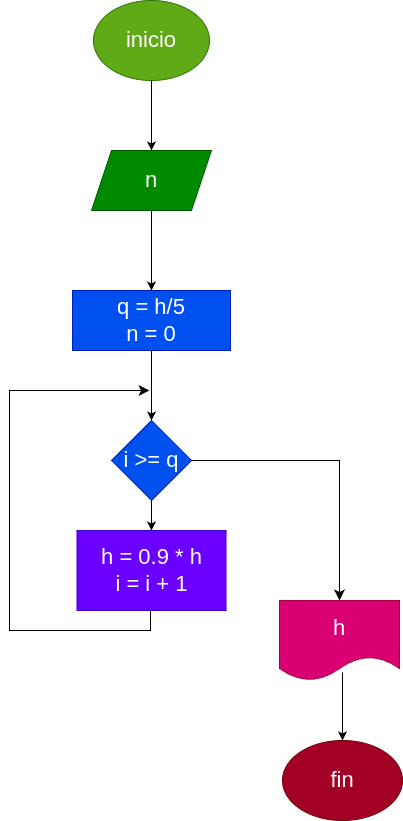

# calcular_altura

una pelota se deja caer desde una altura h, y en cada rebote sube el 10% menos que el anterior. hacer el diagrama de flujo y el programa en python, que lea h, y que calcule e imprima en cual revote no alcansa ha subir la 5 parte de la altura inicial

# analisis

## input

### variables

h = altura desde la cual se deja caer la pelota

h = h - (10% h)

i = 0

### processing

    while i >= 5: 
    h = 0.9*h
    i = i + 1

# diseño

# construccion